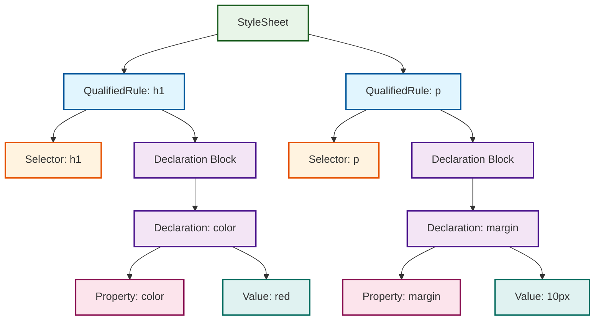

# CSSOM (CSS Object Model) 図解

## サンプルCSS

```css
h1 { 
    color: red; 
}

p { 
    margin: 10px; 
}
```

## CSSOMツリー構造



## より詳細なCSSOM構造

```mermaid
graph TD
    subgraph "StyleSheet"
        A[StyleSheet]
        A --> A1[rules: QualifiedRule[]]
    end
    
    subgraph "Rule 1: h1"
        B[QualifiedRule]
        B --> B1[selector: h1]
        B --> B2[declarations: Declaration[]]
        
        B2 --> C1[Declaration 1]
        
        C1 --> D1[property: 'color']
        C1 --> D2[value: 'red']
    end
    
    subgraph "Rule 2: p"
        F[QualifiedRule]
        F --> F1[selector: p]
        F --> F2[declarations: Declaration[]]
        
        F2 --> G1[Declaration 1]
        
        G1 --> H1[property: 'margin']
        G1 --> H2[value: '10px']
    end
    
    A1 --> B
    A1 --> F
    
    classDef stylesheet fill:#e8f5e8,stroke:#1b5e20,stroke-width:2px
    classDef rule fill:#e1f5fe,stroke:#01579b,stroke-width:2px
    classDef selector fill:#fff3e0,stroke:#e65100,stroke-width:2px
    classDef declaration fill:#f3e5f5,stroke:#4a148c,stroke-width:2px
    classDef property fill:#fce4ec,stroke:#880e4f,stroke-width:2px
    
    class A,A1 stylesheet
    class B,F rule
    class B1,F1 selector
    class B2,F2,C1,G1 declaration
    class D1,H1,D2,H2 property
```

## CSSトークンからCSSOM変換過程

```mermaid
flowchart TD
    subgraph "1. CSSトークン列"
        T1[Ident: h1]
        T2[OpenCurly: '{']
        T3[Ident: color]
        T4[Colon: ':']
        T5[Ident: red]
        T6[SemiColon: ';']
        T7[CloseCurly: '}']
    end
    
    subgraph "2. パース処理"
        P1[QualifiedRule作成]
        P2[Selector設定]
        P3[Declaration作成]
        P4[Property/Value設定]
    end
    
    subgraph "3. CSSOMオブジェクト"
        O1[QualifiedRule]
        O2[selector: 'h1']
        O3[declarations: []]
        O4[Declaration]
        O5[property: 'color']
        O6[value: 'red']
    end
    
    T1 --> P2
    T2 --> P1
    T3 --> P3
    T4 --> P3
    T5 --> P4
    T6 --> P3
    T7 --> P1
    
    P1 --> O1
    P2 --> O2
    P3 --> O4
    P4 --> O5
    P4 --> O6
    
    O1 --> O2
    O1 --> O3
    O3 --> O4
    O4 --> O5
    O4 --> O6
    
    classDef token fill:#ffeb3b,stroke:#f57f17,stroke-width:2px
    classDef process fill:#ff9800,stroke:#e65100,stroke-width:2px
    classDef object fill:#4caf50,stroke:#2e7d32,stroke-width:2px
    
    class T1,T2,T3,T4,T5,T6,T7 token
    class P1,P2,P3,P4 process
    class O1,O2,O3,O4,O5,O6 object
```

## PHPでの実装対応

```php
// CSSトークン化
$tokenizer = new CssTokenizer('h1 { color: red; }');

// CSSOM構築
$parser = new CssParser($tokenizer);
$stylesheet = $parser->parseStylesheet();

// 構造アクセス
$rules = $stylesheet->getRules();           // QualifiedRule[]
$rule = $rules[0];                          // h1ルール
$selector = $rule->getSelector();           // 'h1'
$declarations = $rule->getDeclarations();   // Declaration[]
$declaration = $declarations[0];            // color: red
$property = $declaration->getProperty();    // 'color'
$value = $declaration->getValue();          // 'red'
```

## 凡例
- 🟢 **緑**: StyleSheet（ルートノード）
- 🔵 **青**: QualifiedRule（CSSルール）
- 🟠 **橙**: Selector（セレクタ）  
- 🟣 **紫**: Declaration（宣言）
- 🔴 **赤**: Property/Value（プロパティ/値）
