# Layout Tree構造の説明

## 概要

Layout Treeは、DOM Tree（Document Object Model）から生成される、Webページのレイアウト計算のためのツリー構造です。各ノードはLayoutObjectとして表現され、要素の位置、サイズ、スタイル情報を持ちます。

## Layout TreeとCSS適用の関係

HTMLドキュメントがパースされてDOM Treeが構築された後、CSS規則が適用されてLayout Treeが作成されます。この過程で、各要素のスタイル情報（色、サイズ、表示形式など）が計算され、最終的な表示位置が決定されます。

## サンプルLayout Tree構造

以下は、シンプルなHTML文書から生成されるLayout Treeの例です：

```html
<!DOCTYPE html>
<html>
<body>
    <h1 style="color: red;">Hello World</h1>
</body>
</html>
```

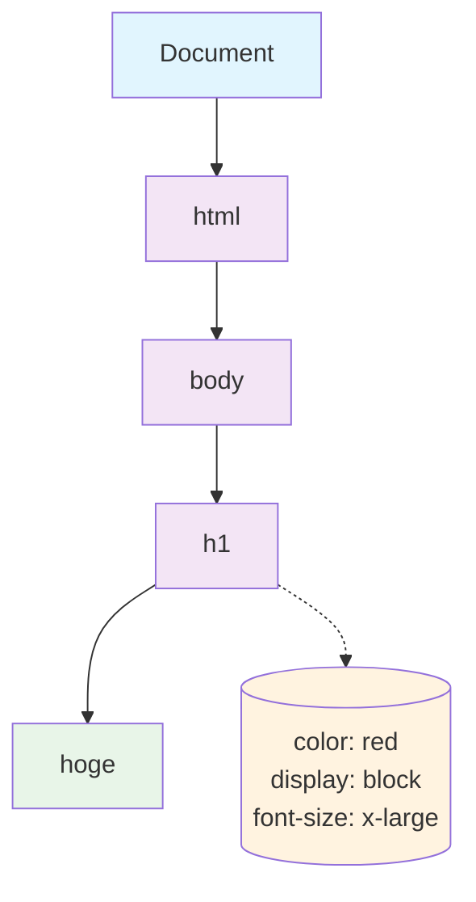

## DOM TreeからLayout Tree構築の段階的な処理

以下のシンプルなHTMLドキュメントを例に、DOM TreeからLayout Treeが構築される過程を段階的に見てみましょう。

```html
<!DOCTYPE html>
<html>
<body>
    <div class="container">
        <h1 style="color: red;">Title</h1>
        <p style="display: none;">Hidden</p>
        <span>Text</span>
    </div>
</body>
</html>
```

### 段階1: DOM Tree構築

最初にHTMLパーサーによってDOM Treeが構築されます。

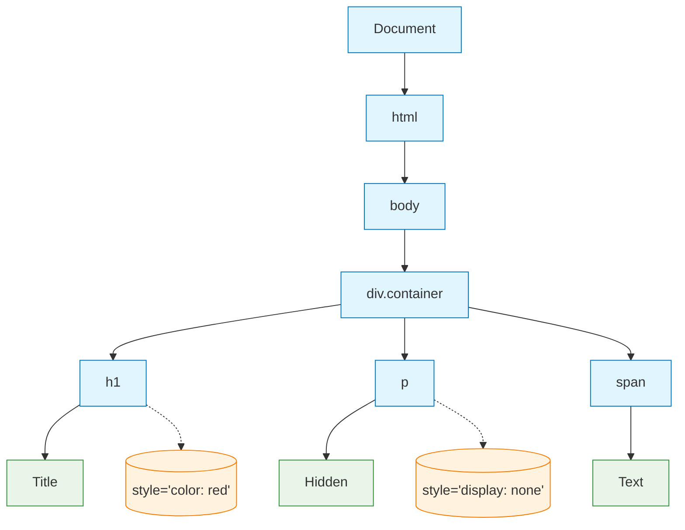

### 段階2: CSS解析とセレクタマッチング

CSSルールが解析され、各DOM要素とのマッチングが行われます。

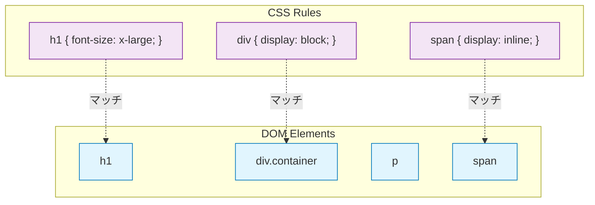

### 段階3: Layout Object作成とdisplay:none要素の除外

DOM要素に対応するLayout Objectが作成されますが、`display: none`の要素は除外されます。

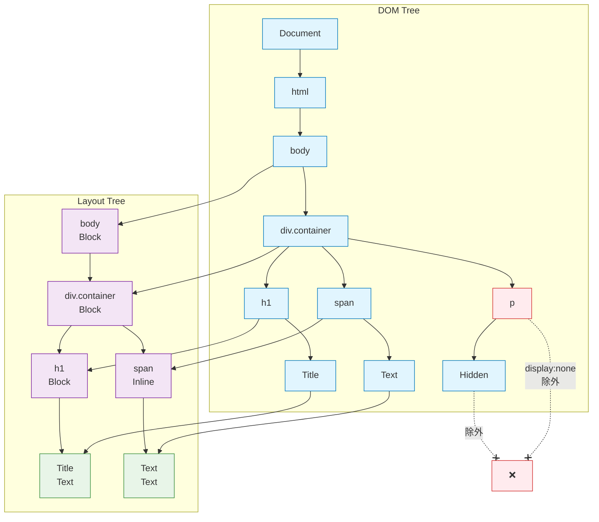

### 段階4: Layout Object種類の決定とスタイル適用

各Layout Objectの種類（Block/Inline/Text）が決定され、スタイル情報が適用されます。

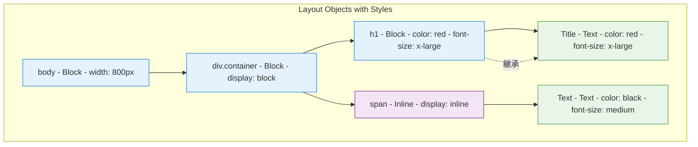

### 段階5: サイズ計算 (computeSize)

親から子へと再帰的にサイズが計算されます。

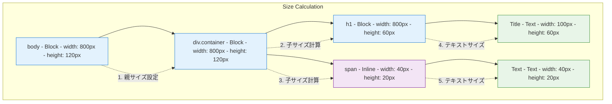

### 段階6: 位置計算 (computePosition)

各Layout Objectの画面上の位置が計算されます。

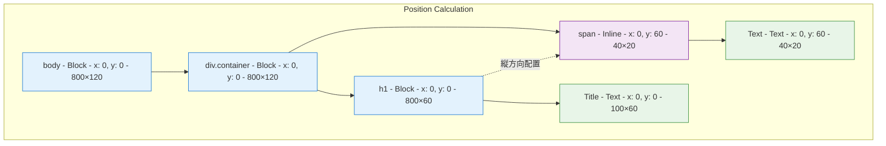

### 段階7: 最終的なLayout Tree

最終的に構築されたLayout Treeには、描画に必要な全ての情報が含まれています。

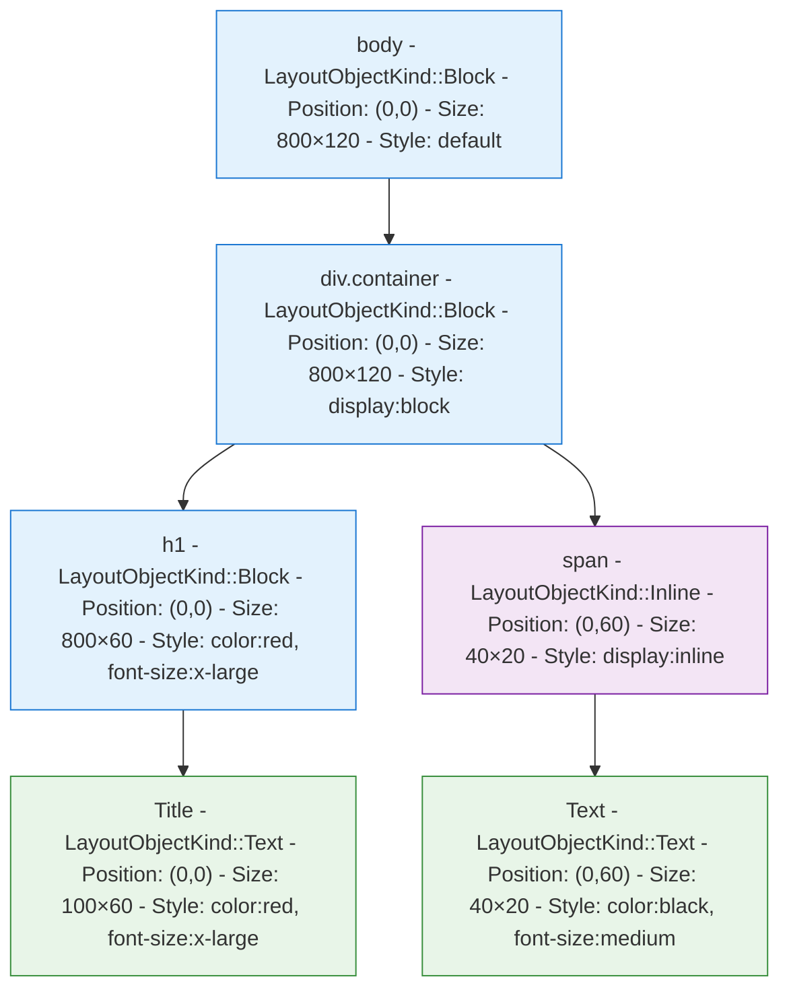

## 重要なポイント

### 1. `display: none`要素の除外
- DOM Treeには存在するが、Layout Treeには含まれない
- 子要素も一緒に除外される
- レンダリングの最適化に寄与

### 2. Layout Object種類の決定
- **Block要素**: 縦方向に積み重なる（`<div>`, `<h1>`, `<p>`など）
- **Inline要素**: 横方向に並ぶ（`<span>`, `<a>`など）
- **Text要素**: 実際のテキスト内容を描画

### 3. スタイル継承とカスケーディング
- 親要素のスタイルが子要素に継承される
- インラインスタイル > CSS規則の優先順位
- `ComputedStyle`で最終的なスタイル値を管理

### 4. レイアウト計算の順序
1. **サイズ計算**: 親から子へとサイズを決定
2. **位置計算**: ブロック要素は縦方向、インライン要素は横方向に配置
3. **描画準備**: `DisplayItem`生成の準備完了

このようにして、DOM TreeからLayout Treeへの変換が段階的に行われ、最終的にWebページのレンダリングに必要な全ての情報が整います。

## 実際のLayout Treeノード詳細情報

実際のLayoutObjectが持つ具体的な情報を含むLayout Treeの構造を詳細に図示します。

### 例: シンプルなHTML文書のLayout Tree

```html
<!DOCTYPE html>
<html>
<body>
    <div class="container" style="background-color: #f0f0f0;">
        <h1 style="color: red; font-size: x-large;">Hello World</h1>
        <p style="display: none;">Hidden Text</p>
    </div>
</body>
</html>
```

### Layout Tree with Node Information (Overview)

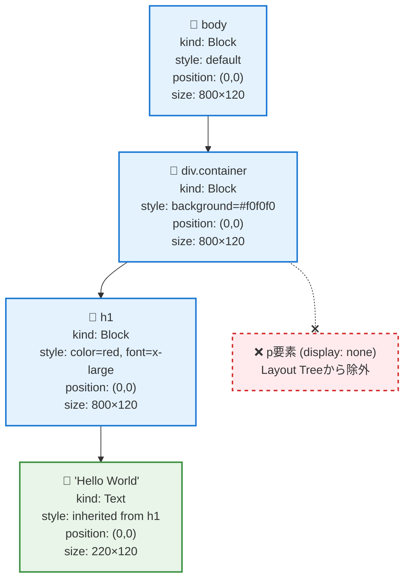

### LayoutObjectが持つ主要情報

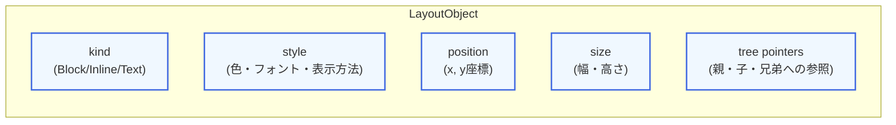

#### LayoutObjectの核となる5つの情報

1. **kind** - レイアウトタイプ（Block/Inline/Text）
2. **style** - 計算済みスタイル（色、フォント、背景色など）
3. **position** - 画面上の位置（x, y座標）
4. **size** - 要素のサイズ（幅、高さ）
5. **tree pointers** - ツリー構造の参照（親、子、兄弟ノード）

### 構築処理の概要フロー

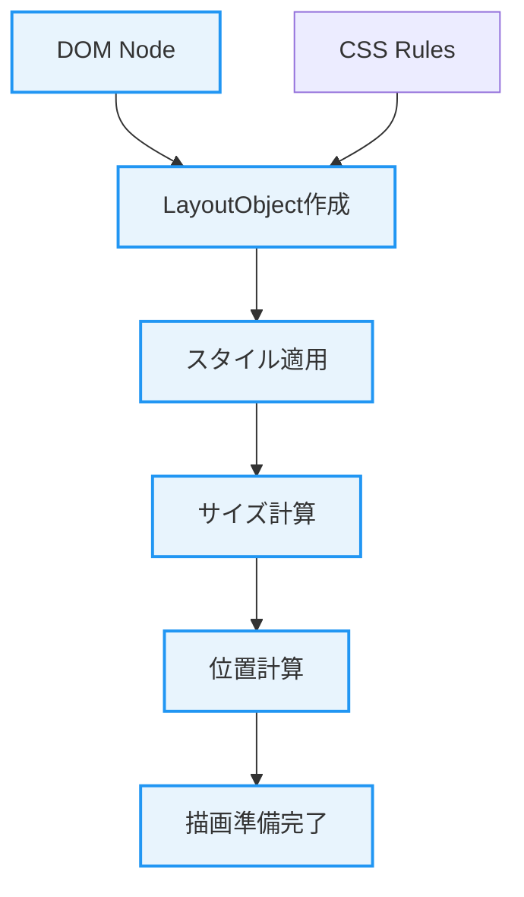


## Layout Objectの種類

Layout Treeの各ノードは、以下のいずれかの種類に分類されます：

### 1. Block Layout Object
- **特徴**: ブロックレベル要素（`<div>`, `<p>`, `<h1>`など）
- **レイアウト**: 縦方向に積み重なる
- **幅**: 親要素の幅いっぱいに広がる

### 2. Inline Layout Object  
- **特徴**: インライン要素（`<span>`, `<a>`など）
- **レイアウト**: 横方向に並ぶ
- **幅**: コンテンツの幅に合わせる

### 3. Text Layout Object
- **特徴**: テキストノード
- **レイアウト**: 文字列の描画を担当
- **サイズ**: フォントサイズに基づいて計算

## レイアウト計算の流れ

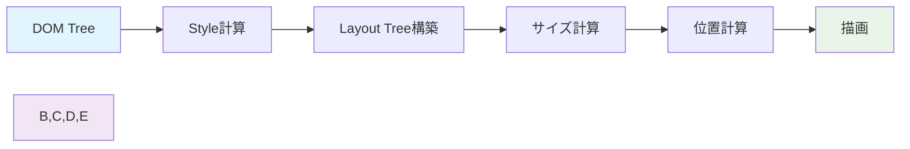

### 1. Style計算 (cascadingStyle)
CSS規則をDOM要素に適用し、最終的なスタイル値を決定します。

### 2. Layout Tree構築
DOM TreeからLayout Treeを生成し、`display: none`の要素などは除外されます。

### 3. サイズ計算 (computeSize)
各Layout Objectの幅と高さを計算します。親から子へと再帰的に処理されます。

### 4. 位置計算 (computePosition)
各Layout Objectの画面上の位置（x, y座標）を計算します。

### 5. 描画 (paint)
Layout Objectの情報を基に、実際の描画命令（DisplayItem）を生成します。

## より複雑なLayout Tree例

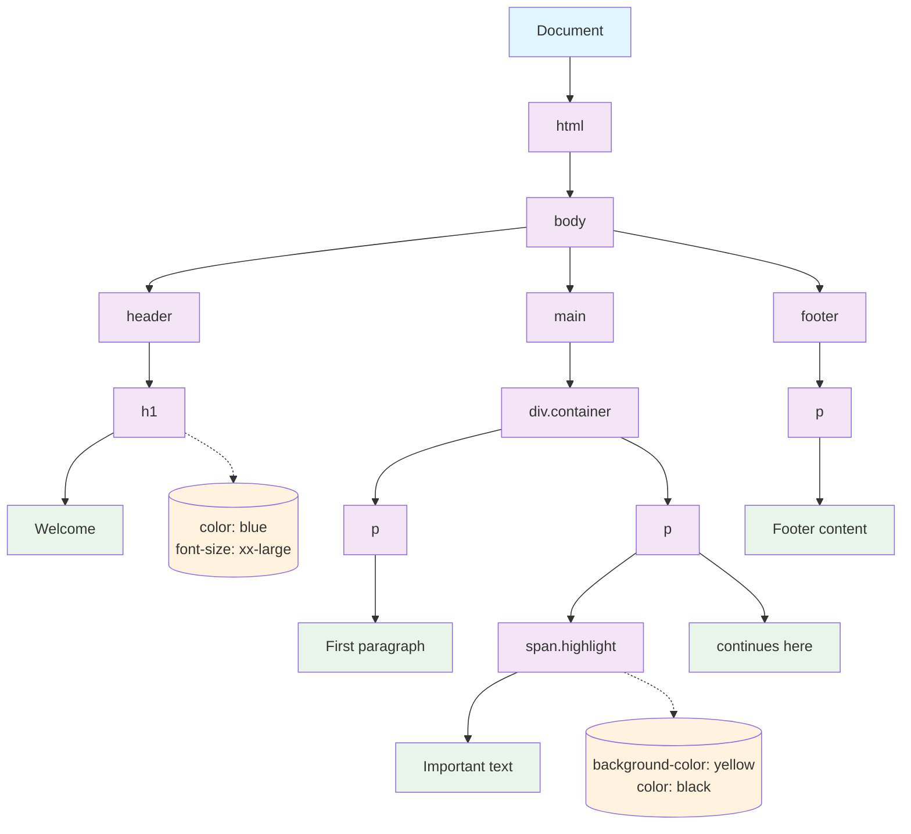

## LayoutObjectクラスの主要メソッド

| メソッド | 説明 |
|----------|------|
| `paint()` | 描画命令（DisplayItem）を生成 |
| `computeSize()` | サイズを計算 |
| `computePosition()` | 位置を計算 |
| `cascadingStyle()` | CSS規則を適用 |
| `updateKind()` | Layout Objectの種類を更新 |
| `isNodeSelected()` | CSSセレクタにマッチするかチェック |

## 実装上の特徴

- **ツリー構造**: 親子関係（`parent`, `firstChild`）と兄弟関係（`nextSibling`）で構成
- **スタイル情報**: `ComputedStyle`オブジェクトで管理
- **位置・サイズ**: `LayoutPoint`と`LayoutSize`で座標とサイズを管理
- **描画最適化**: `display: none`の要素は描画をスキップ

このLayout Tree構造により、Webページの効率的なレンダリングが可能になります。
