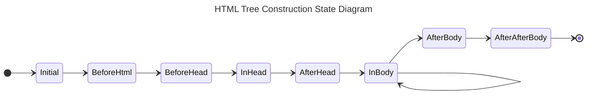
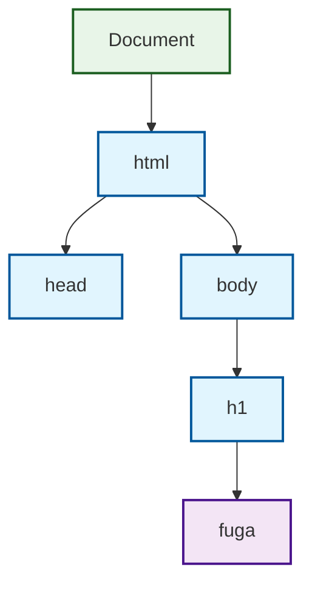
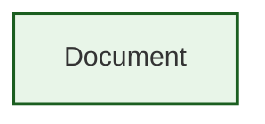
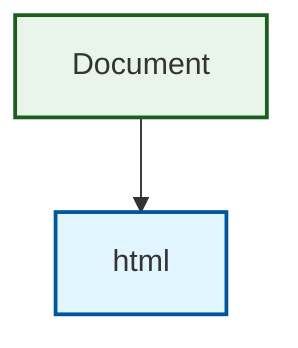
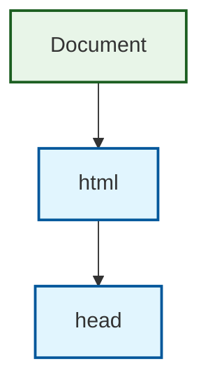
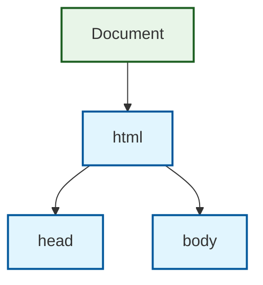

# HTML Tree Construction State Diagram



## 主要な状態の説明

### 初期状態
- **Initial**: パーサーの開始状態

### HTML構造の構築
- **Before html**: html要素の前
- **Before head**: head要素の前  
- **In head**: head要素内
- **After head**: head要素の後

### ボディ部分の解析
- **In body**: body要素内（メインの解析状態、ループ処理）
- **After body**: body要素の後

### 終了状態
- **After after body**: 文書解析完了後
- **EOF**: 文書の終端

## DOMツリーの構築過程

サンプルHTML: `<html><head></head><body><h1>fuga</h1></body></html>`

### 1. Initial状態
```
Document
```
- ドキュメントノードのみが存在

### 2. Before html状態（html開始タグ処理）
```
Document
└── html
```
- html要素がドキュメントに追加される

### 3. Before head状態（head開始タグ処理前）
```
Document
└── html
```
- html要素内でhead要素を待機

### 4. In head状態（head開始タグ処理後）
```
Document
└── html
    └── head
```
- head要素がhtml要素の子として追加

### 5. After head状態（head終了タグ処理後）
```
Document
└── html
    └── head
```
- head要素の処理完了

### 6. In body状態（body開始タグ処理後）
```
Document
└── html
    ├── head
    └── body
```
- body要素がhtml要素の子として追加

### 7. In body状態（h1要素処理）
```
Document
└── html
    ├── head
    └── body
        └── h1
            └── "fuga"
```
- h1要素とテキストノード"fuga"が追加

```php
<?php
/**
 * In Body状態での処理 - DOMツリーの主要な構築が行われる
 */
private function handleInBodyMode(HtmlToken $token): void
{
    switch (true) {
        // 📝 テキスト文字の処理
        case $token instanceof CharToken:
            // "fuga" などの文字をテキストノードとして挿入
            $this->insertChar($token->getChar());
            break;

        // 🏷️ 開始タグの処理
        case $token instanceof StartTag:
            $tagName = $token->getTag();
            if ($tagName === 'h1') {
                // <h1> 要素を作成してDOMツリーに追加
                $element = $this->createElement($token);
                $this->insertElement($element);
            } 
            break;

        // 🔚 終了タグの処理
        case $token instanceof EndTag:
            $tagName = $token->getTag();
            
            if ($tagName === 'h1') {
                // h1要素を閉じる - スタックからポップ
                $this->popUntil($tagName);
            break;
    }
}

/**
 * 要素をDOMツリーに挿入 & スタック管理
 */
private function insertElement(Node $element): void
{
    // 現在のノード（スタックの最上位）の子として追加
    $currentNode = $this->getCurrentNode(); // body要素
    $currentNode->appendChild($element);    // body → h1 の親子関係
    
    // 要素をスタックにプッシュ
    $this->stackOfOpenElements[] = $element; // [html, body, h1]
}

/**
 * テキストノードの挿入
 */
private function insertChar(string $char): void
{
    $currentNode = $this->getCurrentNode(); // h1要素
    
    // 新しいテキストノードを作成して追加
    $textNode = new Node(NodeKind::Text, $char);
    $currentNode->appendChild($textNode); // h1 → "fuga" の親子関係
}

/**
 * 指定タグまでスタックをポップ
 */
private function popUntil(string $tagName): void
{
    while (!empty($this->stackOfOpenElements)) {
        $element = array_pop($this->stackOfOpenElements);
        if ($element->getTagName() === $tagName) {
            break; // 該当要素を見つけたら終了
        }
    }
}
```

### 8. After body状態（body終了タグ処理後）
```
Document
└── html
    ├── head
    └── body
        └── h1
            └── "fuga"
```
- 最終的なDOMツリーが完成

## DOMツリー構築のポイント

1. **段階的構築**: 各状態で少しずつDOMツリーが構築される
2. **親子関係**: 要素の開始タグで親子関係が確立される
3. **テキストノード**: テキスト内容は独立したノードとして追加される
4. **状態管理**: パーサーの状態により、要素の挿入場所が決定される

## MermaidによるDOMツリー図解

### 最終的なDOMツリー構造


### 段階的構築過程（主要な状態のみ）

#### 1. Initial状態


#### 2. Before html状態（html要素追加）


#### 3. In head状態（head要素追加）


#### 4. After head状態（head処理完了）


#### 5. In body状態（body要素追加）


#### 6. 最終状態（h1要素とテキスト追加）


### 凡例
- 🟢 **緑**: Documentノード
- 🔵 **青**: Element（要素）ノード
- 🟣 **紫**: Text（テキスト）ノード

## PHPでの実装との対応

このDOMツリー構築は、PHPの`HtmlParser`クラスの`constructTree()`メソッドで実装されています：

```php
$parser = new HtmlParser($html);
$window = $parser->constructTree();
$document = $window->getDocument();

// DOMツリーの可視化
echo Utils::convertDomToString($document);
```

パーサーの状態遷移に従って、各要素が適切な親子関係でDOMツリーに追加されていきます。